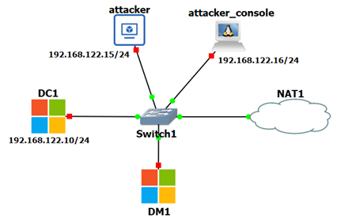

#Lab setup

The lab experiments will be performed using GNS3. The network scenario for the experiments is shown in Figure 1. DC1 and DM1 are both Windows Server 2022 appliances; the attacker is an Ubuntu Cloud Guest 22.04 appliance; the attacker_console is a Toolbox appliance.

{ align=left }