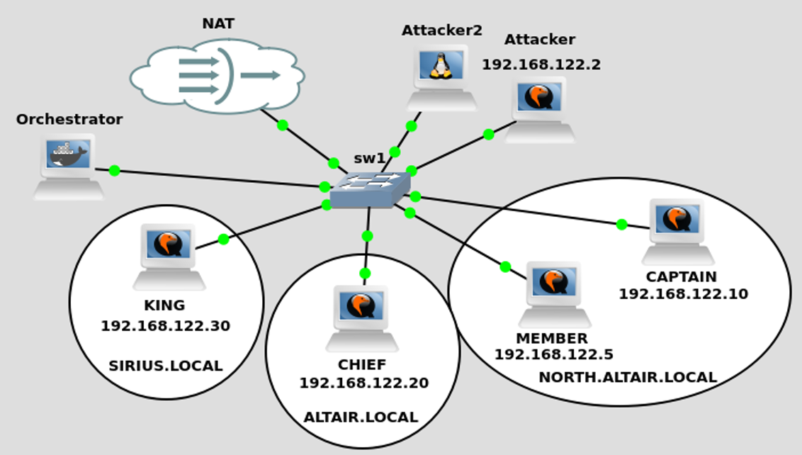

#Lab setup

The lab experiments will be performed using GNS3. The network scenario for the multi-domain environment experiments is shown in Figure 1. 


{ align=left }

CAPTAIN and MEMBER are both custom Windows Server 2016 appliances, while KING and CHIEF are Windows Server 2022 appliances. These appliances' templates are pre-configured for receiving commands through Ansible. You can choose between using Windows appliances with GUI (heavier on resources), or without a GUI (lighter on resources). The lab's Ansible script is expecting you to have GUIs on either **all** machines or **none** of them.

Choose the .zip file containing the files required for your case. If you choose to use GUIs on Windows machines, download [ADLab-MultiDomain-GUI.zip](../multi-domain-attacks/ADLab-MultiDomain-GUI.zip). If you choose to not have GUIs on Windows machines, download [ADLab-MultiDomain-NoGUI.zip](../multi-domain-attacks/ADLab-MultiDomain-NoGUI.zip).


Now, to import the GNS3 .qcow2 files to be used as GNS3 templates, do the following: 

- Open GNS3
- Go to **Edit -> Preferences -> Qemu VMs**
- Press "New"
- The Name of the template must be given according to the GUI choice. If you opted for the no GUI option, the name must be "custom_windows_NoGUI" in case the .qow2 file pertains to Windows Server 2016. If the file pertains to Windows Server 2022 template, the name must be "custom_windows_NoGUI2022". If you opted for the GUI option, the name must be "custom_windows", for Windows Server 2016, or "custom_windows2022" for Windows Server 2022 . Do not give a different name to the template.
- Leave the RAM and Qemu binary fields as is.
- Set the console type to "vnc".
- In the Disk Image menu, pick "New Image".
- Press "Browse" and navigate to the respecive .qcow2 file that you can find in the previsouly mentioned zip file. In this case, if you've opted for no GUI, the files are "windows_server_2016_NoGUI_AnsibleReady_flat.qcow2" or "windows_server_2022_NoGUI_AnsibleReady_flat.qcow2". Otherwise the correct files are "windows_server_2016_GUI_AnsibleReady_flat.qcow2" or "windows_server_2022_GUI_AnsibleReady_flat.qcow2".
- Press "Finish"
- You must have both custom templates ready. One for each OS version. At this point, if you picked the GUI machines, you should have a "custom_windows" and a "custom_windows2022" template ready to instantiate in GNS3. In case of not using GUI, you should have both the "custom_windows_NoGUI" and "custom_windows_NoGUI2022" templates ready.

The Orchestrator machine is a docker container. To retrieve this container into a GNS3 template:

- Open GNS3
- In GNS3, go to **Edit -> Preferences -> Docker Containers**
- Press "New"
- Select "Existing image" and in "Image Name" write: "buzz115/orchestrator:latest".
- Confirm the template name is "buzz115-orchestrator".
- Press "Next" on every screen and "Finish" at the end, keeping default values throughout the rest of the configuration.

Orchestrator contains different Ansible scripts that will be used to setup the lab environment automatically.

The Attacker machine is an Ubuntu Cloud Guest appliance. To retrieve it:

- Press "Browse End Devices", on the left menu (The button that looks like a monitor).
- Then, press "New Template".
- Choose "Install an appliance from the GNS3 server (recommended)", and click "Next".
- Open the "Guests" menu. Pick "Ubuntu Cloud Guest". Press "Install".
- Choose the server type and the Qemu binary accordingly.
- Install "Ubuntu Cloud Guest version Ubuntu 22.04 LTS (Jammy Jellyfish)"
- Name the template "Ubuntu Cloud Guest Ubuntu 22.04 LTS (Jammy Jellyfish)" exactly.


The Attacker2 machine is a "Toolbox" appliance. To retrieve it, follow the same steps presented for the Attacker machine, but instead of choosing "Ubuntu Cloud Guest" in the "Guests" menu, choose "Toolbox". The template must have the name "Toolbox".

Before proceeding, make sure you:

- Have the custom Windows 2016 image available as a GNS3 Template named "custom_windows_NoGUI"/"custom_windows", as well as the custom Windows 2022 image available as a GNS3 Template named "custom_windows_NoGUI2022"/"custom_windows2022".  Pick the correct name according to your GUI preference. The template names must have one of these values, otherwise the script that builds the lab will fail.
- Have the custom docker container available as a GNS3 Template named "buzz115-orchestrator". The template name must have this value.
- Have the Toolbox available as a GNS3 Template named "Toolbox". The template name must have this value.
- Have the specified Ubuntu Cloud Guest image available as a GNS3 Template named "Ubuntu Cloud Guest Ubuntu 22.04 LTS (Jammy Jellyfish)". The template name must have this value.

Once the templates are correctly imported to GNS3, run the "CreateADLab.py" script. This script is included in the downloaded zip, along with a python module. Both python files must be in the same dir when executing "CreateADLab.py".
```
usage: CreateADLab.py [-h] --project PROJECT [--path PATH] [--server-path SERVER_PATH] (--no-gui | --gui) (--single-domain | --multi-domain)

#for a lab with Windows GUIs installed on the machines, run:
python3 CreateADLab.py --project MyADProject --gui --multi-domain

#for a lab without Windows GUIs installed on the machines, run:
python3 CreateADLab.py --project MyADProject --no-gui --multi-domain
```

This script will create the GN3 Lab with the required nodes and links. Once the project is created, open it. Start **all** devices.
Once all devices are turned on, access the Orchestrator machine. At the terminal, head to the respective ansible directory. There are four ansible directories: 

- One for the multi-domain environment and no GUIs
- One for the multi-domain environment with GUIs
- One for the single-domain environment with GUIs
- And one for the single-domain environment without GUIs

Choose the one you wish to use, which in this case, must be a dir referring to the multi-domain environment. Pick the one that uses GUIs or not, depending on your choice.

Once in the dir, run:
```
ansible-playbook create_lab.yml
```

And now, Orchestrator will use an Ansible script to configure the lab's machines (KING, CHIEF,CAPTAIN, MEMBER, and Attacker). This will take some time. Once the script finishes without errors, the environmnet is ready. Have fun.

**AUTOMATION REMARKS**

Sometimes, unfortunately, when machines are deployed in the lab, they are given a random IP address from the 192.168.122.0/24. These addresses can sometimes cause a conflict in automation. For example, the MEMBER machine has the 192.168.122.2 IP address given by DHCP set in the NAT node from GNS3. Then, the Ansible script will set 192.168.122.2 to the Attacker machine, and once it tries to connect to the MEMBER at the same IP, the connection can fail.

In these cases, if you have some Ansible errors related with connections, that might be the culprit. If you find yourself in this situation, my suggestion is to delete the current project, execute the Python script again, and run Ansible. Most of the times you won't get this problem, but it can happen.
